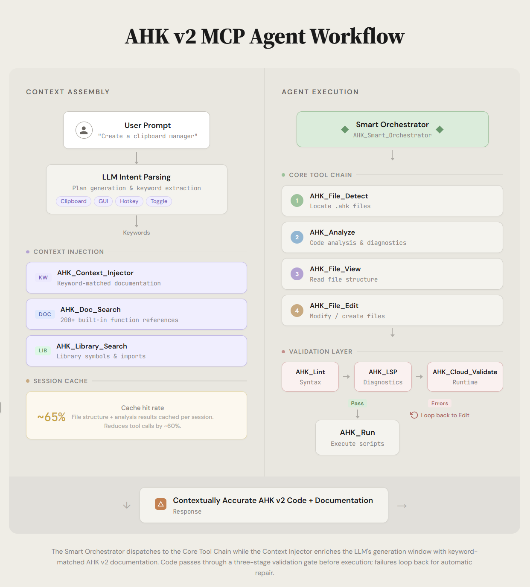

<div align="center">

# AutoHotkey v2 MCP Server

A TypeScript MCP server for AutoHotkey v2 development. It provides script
analysis, file operations, documentation search, and script execution tools for
MCP clients such as Claude Desktop.

[](#highlights)
[](#installation)
[](#run)
[](#development-commands)

</div>

## Architecture



## Highlights

- 25+ `AHK_*` tools for AutoHotkey workflows
- Focused file discovery and active-file aware operations
- Script execution with process tracking and window detection
- Local AutoHotkey validation and diagnostics tools
- Built-in AutoHotkey docs and prompt/context helpers
- Stdio and Streamable HTTP transports (stateful or stateless), plus legacy SSE
  endpoints
- Opt-in bearer-token auth and DNS-rebinding protection for HTTP mode

## Requirements

- Node.js 18+
- npm
- AutoHotkey v2 (for run/validate tools)

## Installation

```bash
git clone https://github.com/truecrimedev/ahk-mcp.git
cd ahk-mcp
npm install
npm run build
```

## Run

```bash
npm start
```

Development mode:

```bash
npm run dev
```

Smoke test:

```bash
npm run smoke:mcp
```

## HTTP Mode and Environment Variables

`npm start` speaks stdio (Claude Desktop). To expose Streamable HTTP on `/mcp`
(plus legacy SSE endpoints), set `PORT` or pass `--sse`:

```bash
npm run start:sse
```

Behavior is controlled with environment variables:

| Variable                    | Default   | Purpose                                                                                                                            |
| --------------------------- | --------- | ---------------------------------------------------------------------------------------------------------------------------------- |
| `PORT`                      | `3000`    | HTTP port; setting it enables HTTP mode                                                                                            |
| `AHK_MCP_STATELESS`         | off       | `true` runs `/mcp` in the MCP spec's stateless mode: no `mcp-session-id`, a fresh transport per `POST`, safe behind load balancers |
| `AHK_MCP_AUTH_TOKEN`        | unset     | When set, every HTTP request must send `Authorization: Bearer <token>`; unset means **no authentication**                          |
| `AHK_MCP_ALLOWED_HOSTS`     | unset     | Comma-separated `Host` allowlist; enables DNS-rebinding protection (e.g. `localhost:3000,127.0.0.1:3000`)                          |
| `AHK_MCP_ALLOWED_ORIGINS`   | unset     | Comma-separated `Origin` allowlist for browser clients                                                                             |
| `AHK_MCP_TASK_RETENTION_MS` | `1800000` | How long finished task records are kept (30 min); `0` keeps them until process exit                                                |
| `AHK_MCP_LOG_LEVEL`         | `warn`    | `error`, `warn`, `info`, or `debug`                                                                                                |

Security note: the tool surface includes file writes and process execution. If
the HTTP port is reachable by anything other than your own machine, set
`AHK_MCP_AUTH_TOKEN` (e.g. `openssl rand -hex 32`) and the two allowlists — by
default the endpoints accept every request.

See `docs/MCP_TRANSPORT_COMPATIBILITY.md` for the session flow, stateless mode
details, and cURL examples.

## Claude Desktop Configuration

Add this to `claude_desktop_config.json`:

```json
{
  "mcpServers": {
    "ahk": {
      "command": "C:\\Program Files\\nodejs\\node.exe",
      "args": ["C:\\Users\\YourUsername\\path\\to\\ahk-mcp\\dist\\index.js"],
      "env": {
        "NODE_ENV": "production",
        "AHK_MCP_LOG_LEVEL": "warn"
      }
    }
  }
}
```

Use absolute paths and escape backslashes in JSON.

## Configure AutoHotkey Path and Startup Behavior

Use `AHK_Config` to set the executable path and non-blocking startup behavior:

```json
{
  "action": "set",
  "ahkPath": "C:\\Users\\YourUsername\\Documents\\Design\\Coding\\AutoHotkey\\bin\\AutoHotkey64.exe",
  "waitForStdoutLine": true,
  "stdoutLineTimeoutMs": 300
}
```

This is used by `AHK_Run` (and `AHK_Cloud_Validate` path resolution).

## Core Tools

- `AHK_Smart_Orchestrator`: reduce multi-step edit/analysis workflows
- `AHK_File_List`, `AHK_File_View`, `AHK_File_Edit`: file operations
- `AHK_Analyze`, `AHK_Diagnostics`: analysis and diagnostics
- `AHK_Run`: execute scripts (wait, non-wait, window detection)
- `AHK_Cloud_Validate`: local execution-based validation
- `AHK_Doc_Search`, `AHK_Tools_Search`: documentation and tool lookup
- `AHK_Config`: MCP server configuration

## Development Commands

```bash
npm run build
npm run clean
npm run lint
npm run test
npm run test:integration
npm run smoke:mcp
```

## Documentation

- `docs/README.md`
- `docs/QUICK_START.md`
- `docs/QUICKREFERENCE.md`
- `docs/MCP_TRANSPORT_COMPATIBILITY.md`
- `docs/ARCHITECTURE_DIAGRAMS.md`
- `docs/RELEASE_NOTES.md`

## Contributing

See `CONTRIBUTING.md` and `AGENTS.md`.

## License

MIT. See `LICENSE`.
