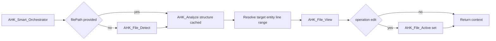
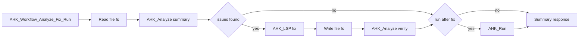
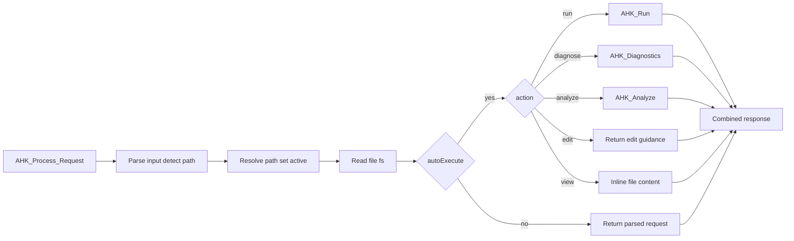
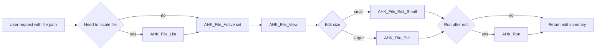
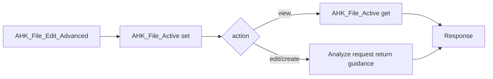

# Toolchain Diagrams

This document summarizes the composite tools that orchestrate other tools or
internal steps. Each diagram shows the primary control flow; conditional paths
are annotated on the edges.

## AHK_Smart_Orchestrator (detect -> analyze -> view/edit)

## AHK_Workflow_Analyze_Fix_Run (analyze -> fix -> verify -> run)

## AHK_Process_Request (parse -> route)

## Recommended Manual Toolchain: File Edit (agent guidance)

This is the suggested sequence from `docs/AHK_AGENT_INSTRUCTION.md` when a user
asks to edit an existing script. It is not a composite tool.

## AHK_File_Edit_Advanced (guided edit)

## Tools Outside These Chains

The following tools are not part of the chains shown above (based on the current
tool list used for `tools/list`):

- AHK_Analytics
- AHK_Config
- AHK_Context_Injector
- AHK_Debug_Agent
- AHK_Doc_Search
- AHK_File_Create
- AHK_File_Recent
- AHK_Library_Import
- AHK_Library_Info
- AHK_Library_List
- AHK_Lint
- AHK_Prompts
- AHK_Settings
- AHK_Tools_Search
- AHK_VSCode_Open
- AHK_VSCode_Problems
